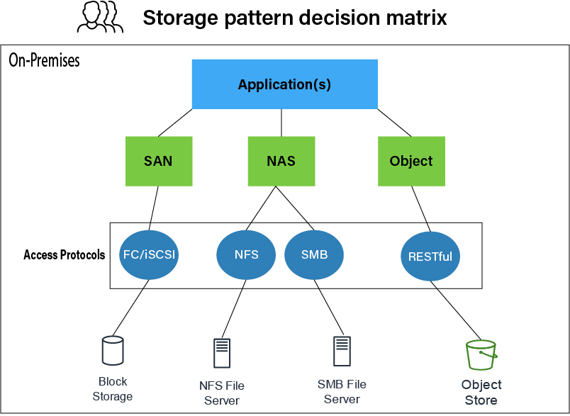
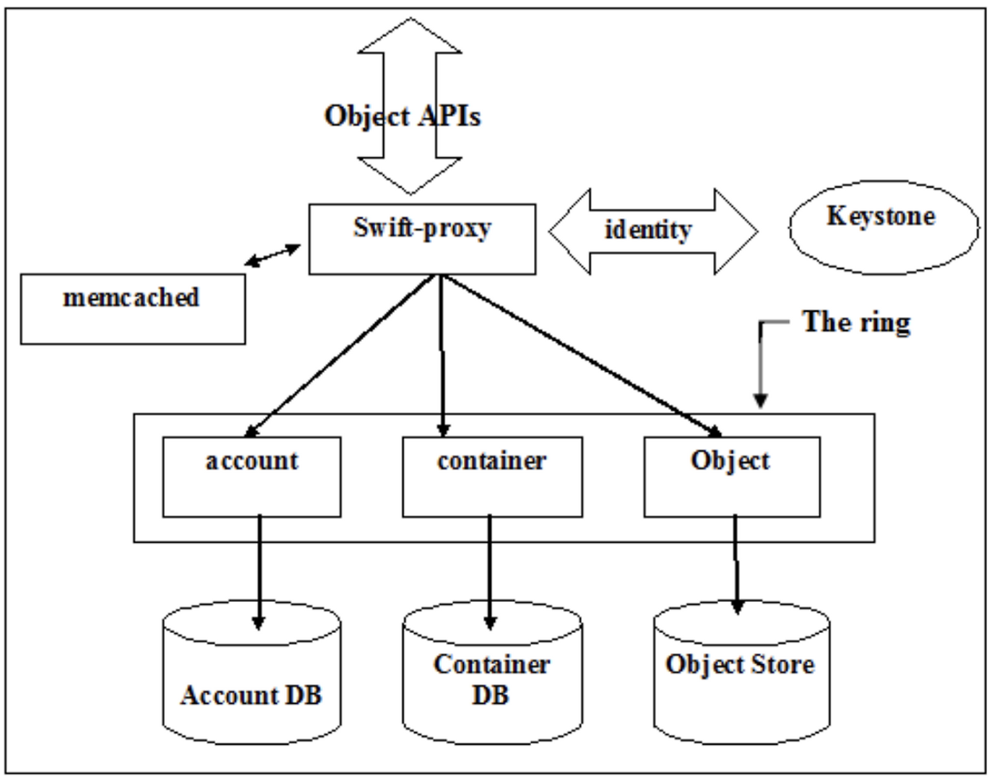

# 5. Storage

| 서비스 | 타입 | 설명 |
|---|---|---|
| **Cinder** | Block Storage | VM에 연결하는 영구 블록 디스크 |
| **Swift** | Object Storage | 비정형 데이터 저장 (API 접근) |
| **Manila** | Shared Filesystem (NFS) | 여러 VM이 공유하는 파일시스템 |



---

### VM 내부 디스크 디바이스 매핑

VM 내부에서 `/dev/` 하위에 디스크들이 아래 순서로 매핑되어 보인다.

| 디바이스 | 디스크 종류 | 설명 |
|---|---|---|
| `/dev/vda` | Root Disk | Boot 영역 포함, 필수 |
| `/dev/vdb` | Ephemeral Disk | 임시 디스크, optional |
| `/dev/vdc` | Swap Disk | 가상 메모리 영역, optional |
| `/dev/vdd~` | Volume (Cinder) | 추가 attach한 영구 디스크 |

> KVM 기반 VM에서는 virtio 드라이버를 사용하므로
> 디바이스명이 `/dev/vd*` 형태로 표시된다.
> (SCSI 드라이버 사용 시 `/dev/sd*` 로 표시될 수 있음)

---

## 5-1. Volume (Cinder — Block Storage)

VM과 논리적으로 연결되는 **영구 스토리지**.
Cinder가 Block Storage 형태로 제공하며,
VM 삭제 후에도 데이터가 보존되고 다른 VM에 재연결 가능.

### Block Storage 백엔드 종류

| 종류 | 연결 방식 | 특징 |
|---|---|---|
| **SAN + FC** | Fibre Channel (SAN 스위치) | 빠름, 고성능, 고비용 |
| **iSCSI** | IP 네트워크 기반 | 저비용, FC 대비 느림 |
| **Ceph (RBD)** | 분산 스토리지 | 확장성 높음, OpenStack 권장 |
| **LVM** | 로컬 볼륨 관리 | 단일 노드용, 공유 FS로는 사용 불가 |

> LVM은 단일 노드에서만 사용 가능하므로 **공유 파일시스템 목적으로는 사용하지 말 것.**

### 주요 사용 사례
- 분산 파일시스템 구성
- DB 스토리지 백엔드
- VM의 영구 디스크 (Boot from Volume 등)

---

## 5-2. Object Storage (Swift)

- VM과 직접 연결되지 않고 **API(HTTP)로 접근**하는 스토리지
- 비정형 데이터(이미지, 백업, 로그 등) 저장에 적합
- Key-Value 형태로 데이터 저장

---

## 5-3. Volume Type & 스케줄링

Volume 생성 시 **Volume Type 태그**를 지정할 수 있으며,
Cinder 스케줄러가 이를 보고 적절한 스토리지 백엔드를 자동으로 선택한다.
```
Volume 생성 요청 + Volume Type 지정
↓
Cinder 스케줄러
↓ Volume Type 매칭
적절한 스토리지 백엔드 선택 (Ceph, LVM, SAN 등)
↓
VM에 연결
```

---

## 5-4. Ceph Pool 구조 (Ceph 구성 시)

```
Ceph 클러스터
├── images pool   ← Glance: Base Image 원본 저장
├── vms pool      ← Nova: VM별 COW Delta(Overlay Disk) 저장
└── volumes pool  ← Cinder: Block Volume 저장
```

- **Base Image**: images pool에 저장 (읽기 전용, 여러 VM 공유)
- **Overlay Disk (COW Delta)**: vms pool에 저장
  - Base Image를 COW 방식으로 클론한 후, 각 VM의 변경사항만 기록
  - Base Image는 건드리지 않고 **차이점(Delta)만 Overlay Disk에 누적**
- **Volume**: volumes pool에 저장
  - Cinder가 관리하는 영구 Block Storage
  - VM에 attach/detach 가능
  - DB처럼 **영구적인 상태 저장이 필요한 서비스**에서 Volume을 논리 저장소로 생성한 후 VM에 마운트하여 사용


## 5-5. 스토리지 Migration

---

### 레거시 애플리케이션 스토리지 전환 전략

| 전략 | 설명 | 장점 | 단점 |
|---|---|---|---|
| **Lift and Shift** | 기존 구조 그대로 클라우드로 이전 | 초기 비용 낮음, 빠른 이전 | 시간이 지날수록 운영 비용 증가 |
| **Refactoring** | 클라우드 환경에 맞게 아키텍처·코드 재설계 | 장기적으로 비용 효율적 | 초기 비용·시간 높음 |

---

### Multi-Attach

영구 클러스터형 디스크를 사용하는 레거시 클러스터 환경에서
**DLM(Distributed Lock Manager)** 기반으로 여러 서버가 동일한 Volume을 **동시에 Read-Write로 접근**하는 기술.

> 기본적으로 **스토리지 백엔드가 Multi-Attach를 지원하는지 먼저 확인**해야 한다.
> DLM 없이 Multi-Attach 사용 시 데이터 충돌/손상 위험이 있음.

**제한사항**

| 항목 | 내용 |
|---|---|
| **Volume 암호화** | ❌ 불가 (LUKS 암호화와 함께 사용 불가) |
| **용량 확장** | ❌ 불가 → 처음 생성 시 용량을 충분히 산정해야 함 |
| **데이터 충돌** | ⚠️ DLM 없이 사용 시 데이터 손상 위험 |

---

### Volume 유형 (Volume Type)

Volume 생성 시 지정하는 스토리지 백엔드 및 속성 태그.
Cinder 스케줄러가 Volume Type을 보고 적절한 백엔드를 선택한다.
**관리자가 자유롭게 이름과 속성을 정의**할 수 있으며, 아래는 일반적인 예시.

| Volume Type 예시 | 설명 |
|---|---|
| **LUKS** | Volume 데이터 암호화/복호화 (Linux Unified Key Setup) |
| **SSD Tier** | 고성능 SSD 백엔드 사용 (빠른 I/O가 필요한 워크로드) |
| **HDD Tier** | 저비용 HDD 백엔드 사용 (대용량 저장이 필요한 워크로드) |

```bash
# Volume Type 목록 확인
openstack volume type list

# Volume Type 지정해서 Volume 생성
openstack volume create \
  --type luks \
  --size 10 \
  encrypted-volume
```

### Object Storage (Swift)

- VM에 mount해서 쓰는 방식이 아닌 **HTTP API로 접근**하는 스토리지
- **Nearline 액세스** 방식 (Online과 Offline의 중간)  
- block storage는 metadata를 cinder db에 저장하고 실제 데이터는 backend 스토리지에 저장함. 반면 Object storage는 metadata + 실제 데이터 전부를 object storage에 key-value형식으로 저장하여 사용함  
- swift의 backend storage로 ceph RGW를 쓰기도 함  

---

**Nearline 장점**

| 항목 | 설명 |
|---|---|
| **비용** | Block Storage 대비 저렴, 대용량 저장에 적합 |
| **확장성** | 용량 제한 없이 페타바이트급까지 확장 가능 |
| **내구성** | 여러 노드에 복제 저장, 장애 시에도 데이터 보존 |
| **접근성** | HTTP API로 어디서든 접근 가능, 특정 서버 마운트 불필요 |

---

**적합한 사용 사례**

```
✅ 이미지/동영상 등 대용량 비정형 데이터 저장
✅ 로그 파일 장기 보관
✅ 백업 데이터 저장
✅ Glance 이미지 저장 백엔드
✅ 정적 웹 콘텐츠 배포
✅ Ironic Bare Metal 이미지 저장
✅ Ironic 세부 검사(Introspection) 결과 저장
❌ DB 데이터 (빠른 I/O 필요 → Block Storage 사용)
❌ 실시간 처리 데이터
```

---

**Ironic (Bare Metal Provisioning)**

- VM이 아닌 **물리 서버(Bare Metal)에 직접 OS를 설치/관리**하는 OpenStack 서비스
- Ironic이 사용하는 데이터가 Object Storage(Swift)에 저장됨

| 저장 데이터 | 설명 |
|---|---|
| **Bare Metal 이미지** | 물리 서버에 배포할 OS 이미지 |
| **Introspection 결과** | 물리 서버의 하드웨어 세부 검사 결과 (CPU, RAM, Disk 정보 등) |

```
Ironic 동작 흐름
물리 서버 세부 검사 (Introspection)
        ↓ 검사 결과 저장
Swift Object Storage
        ↓ 이미지 가져옴
물리 서버에 OS 배포 (Bare Metal Provisioning)
```

---

**ETag (Entity Tag)**

- Object 저장 시 자동으로 생성되는 **데이터 무결성 체크 값**
- Object 내용의 **MD5 Hash 값**으로 생성됨

```
Object 저장
        ↓
ETag (MD5 Hash) 자동 생성
        ↓
데이터 전송/저장 후 ETag 비교
├── ETag 일치 ✅ → 데이터 무결성 확인
└── ETag 불일치 ❌ → 데이터 손상/변조 감지
```

> ETag를 통해 replica 간 데이터가 동일한지 확인하고,
> 네트워크 전송 중 데이터 손상 여부를 검증할 수 있음.

---

**The Ring**

Object Storage의 **데이터 위치 지도** 역할을 하는 분산 알고리즘.
핵심 역할은 **Mapping**과 **Replica 관리** 두 가지.

```
The Ring
├── Mapping      ← Object가 어느 노드/디스크에 저장될지 결정
└── Replica 관리 ← 복제본을 몇 개, 어느 Zone에 저장할지 관리
```

**Mapping**
- Object 이름을 Hash하여 저장할 노드/디스크 위치 결정

```
Object 이름 (Key)
        ↓ Hash
어느 노드/디스크에 저장할지 결정
→ "finance-image.qcow2는 Node2의 disk3에 저장"
```

**Replica 관리**
- 기본 3개 복제본을 서로 다른 **Zone**에 분산 저장
- **Zone = Fault Domain** (동일 장애에 영향받는 범위 단위)
- **Region = 하나의 물리적 데이터센터**

```
Region (물리적 데이터센터)
├── Zone1 (Fault Domain) ← replica 1
├── Zone2 (Fault Domain) ← replica 2
└── Zone3 (Fault Domain) ← replica 3
```

- Zone 단위로 장애가 발생하므로, replica를 Zone별로 분산하여
  **하나의 Zone 장애가 전체 서비스에 영향을 주지 않도록** 구성

```
Zone1 장애 발생
        ↓
Zone2, Zone3의 replica로 정상 서비스 유지 ✅
        ↓
Zone1 복구 후 자동으로 replica 재생성
```

> Zone을 Fault Domain 단위로 구성하는 이유:
> 하나의 물리적 장애(전원, 네트워크, 랙)가
> **여러 replica에 동시에 영향을 주지 않도록** 분산하기 위함.


### Object storage의 구조

Object Storage는 Project의 ID를 Account로 가지고,  
Account 내부에서 Container를 생성하고 그 안에 데이터를 저장한다.  
데이터 접근 속도를 높이기 위해 **Memcached**를 사용하여  
인증 토큰 및 계정/컨테이너 메타데이터를 캐싱한다.  

