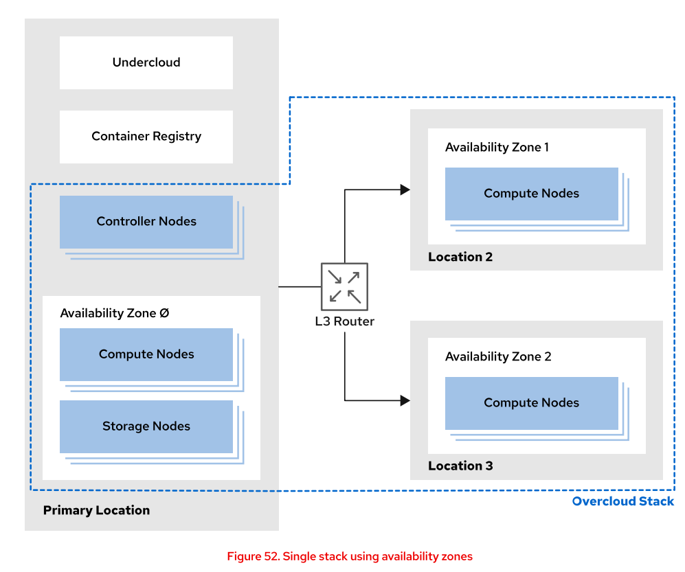

# multi site cloud구성

### multi site cloud 구성할 떄 중요한점

message queue는 timeout있을수잇어서 네트워크속도가 중요
db가 동기화 되는 것이 중요

### 구성

본사에 controller node배치 및 각각의 사이트에compute node를 설치하고 data plane으로 사용함.
DCN(distributed compute node) 라고 불리는 compute node만 사이트에 설치하고, dataplane으로 사용함.
control plane에 image를 저장하고 이를 각 사이트에서 download받아서 사용
이 떄 이미지 다운로드 받을때는 네트워크 속도가 중요함.
이때 시간은 왕복시간을 항상 이야기하는데 RTT=100ms가 나와야함.

네트워크 성능 증대 시키는 법
이미지를 edge(compute node)에서 캐싱해두고 중앙까지 가지 않게 glnaceAPIEdge를 구성함.
그리고 HAproxyEdge 로 로드밸런싱 하여 네트워크 성능을 증가시킴

cluster구성이 되어있으면 항상 정족수를 

HCI는 node+ 스토리지를 의미하는데 이것이 구성되어있으면 이미지를 캐싱해둘수있다.

cluster내부에 data plane 사이에 특정 통신이 끊기면 split brain 현상이 일어나서 데이터가 동기화가 안됨.
정족수를 쓰면 split brain 시에 과반 이상인 곳 즉 정족수를 맞춘 곳의 정보를 뒀다가 나중에 네트워크 연결되고 나면 연결함.

장애 발생 시 구분되는 단위 네트워크나 전원 단위로 구분됨. 이를 region내부에 zone이라고함.





WAN의 속도가 성능을 결정함.


### workload segregation

한정된 운영자원으로 최대 효율로 운영하기 위해서 사용함.
확장성 성능 보안의 장점을 가질 수 있음

물리 특성과 기능을 기반으로 인프라를 그루핑한다.
host level과 cpu level기준으로 그루핑이 가능하다.

1. host-level groupping
host-level(host aggregation & AZ) 물리 호스트 그루핑은 성능기준으로 진행됨.
host groupping하고 그 이름을 flavor로 이름 설정하고 vm배포시에 스펙으로 재사용가능하다.
host aggreagtion은 장소 기준이 아니고 성능기준으로 그루핑하는것이다.

2. cpu-level groupping
over provisioning을 해서 물리cpu보다 더 많은 수의 가상 cpu를 사용할 수 있다.
스케줄링은 co-scheduling을 vcpu하나당 pcpu(physical)를 하나씩 할당해서 작업진행하고 
사용하지 않는 cpu는 ready에 대기해있다가 스케줄링된다.

cpu-pinning은 특정vm의 작업을 처리할 cpu를 고정해두는 것을 말한다.
numa 배치 : SMP(1 메모리 + 여러 프로세스가 bus로 연결된 구조) 를 여러개 붙인게 numa임
non uniform memory access 인데 자기 SMP가 아닌 메모리도 접근하는 구조를 numa라고 함.하나의 소켓 smp단위를 home node라고 함. vm을 배치할 때, numa architecture의 경우에는 한쪽 home node에 배치 될 수 있게 지역성(locality)를 고려해서 배치한다.
이는 flavor에 속성으로 설정할 수 있다.

### Describing Region

Region은 keystone에 의해 정의되는 단일 id서비스를 지원하는 multisite architecture를 구성할 수있다. overcloud구조에서 도시별로 region을 구성해서 통합 cloud를 관리할 수 있고, region안에서 zone을 구성해서 장애 기준으로 삼을 수 있다.
즉 zone안에서만 장애를 대응함.=fault domain

계층구조 형태로 만들 수 있고, 자원을 세분화 하고 장애구역을 구분할 수 있다.

region을 구성안하면 ㅇefault로 regionOne지역이 선택됨.region이 꼭 지역 특징으로 구분되지는 않음.
리소스 서비스수준에 따라서 격리하고싶을 떄, 표준 스토리지, ssd스토리지와 같은 서비스 수준이 구분 기준이 되기도 한다.

### Noav cell

nova끼리 통신하거나 다른 서비스랑 통신할 떄 messageQ를 쓴다.
통신의 message q에서 병목이 오거나 DB병목이 생길 수 있다.
이 병목을 막기 위해서 cell로 쪼개서 관리함. 

Nova도 자체 db정보를 저장한다.

각 cell마다 message queue랑 db를 가지고 있다. 이 cell들의 전체 정보 관리하면서 스케줄링을 해준다. 

zone은 보통 host기준으로 하기도 하고 성능기준으로 하기도 하는데 이런 장소기준이 아닌 그루핑을 host aggregation이라고 함.

하나의 compute노드? 아니면 cpu가 물리적으로는 하나의zone에 속하지만 여러 host aggregation에 집계될 수 있다.


# 10. Multi-Site Cloud 구성

---

## 10-1. 주요 고려사항

| 항목 | 설명 |
|---|---|
| **Message Queue** | timeout 발생 가능 → 네트워크 속도 중요 |
| **DB 동기화** | 사이트 간 DB 동기화 필수 |
| **RTT** | 왕복 지연시간 **100ms 이하** 권장 |
| **WAN 속도** | WAN 성능이 전체 Multi-Site 성능을 결정 |

---

## 10-2. DCN (Distributed Compute Node) 구성

```
본사 (Control Plane)
├── Controller Node
├── Glance (이미지 저장)
└── DB, Message Queue

각 사이트 (Data Plane)
└── DCN (Compute Node만 설치)
    → Control Plane의 지시를 받아 VM 실행
```

- 본사 Controller Node가 전체 제어
- 각 사이트에는 **DCN(Compute Node)만 설치**하여 Data Plane으로 사용
- 이미지는 Control Plane에 저장 → 각 사이트가 다운로드하여 사용
- 이미지 다운로드 시 **RTT 100ms 이하** 네트워크 성능이 핵심

---

## 10-3. 네트워크 성능 향상 방법

**Glance API Edge + HAProxy Edge**

```
본사 Glance (이미지 원본)
        ↓
각 사이트 Edge
├── Glance API Edge  ← 이미지 캐싱 (매번 중앙까지 가지 않음)
└── HAProxy Edge     ← 로드밸런싱으로 네트워크 성능 향상
        ↓
DCN (Compute Node)
```

**HCI (Hyper-Converged Infrastructure)**
- Compute + Storage + Network를 **하나의 노드에 통합**한 구성
- HCI 구성 시 이미지를 **로컬에 캐싱** 가능
- 중앙 스토리지 없이도 독립적으로 운영 가능

---

## 10-4. Split Brain & Quorum (정족수)

**Split Brain**
```
Cluster 내부 노드 간 통신 단절
        ↓
각 노드가 자신이 Master라고 판단
        ↓
데이터 동기화 불가 → 데이터 불일치 발생 ⚠️
```

**Quorum(정족수)으로 해결**
```
전체 노드 수의 과반 이상 = Quorum

예: 3개 노드 중 통신 단절
→ 2개 그룹: Quorum 충족 → Master 유지 ✅
→ 1개 그룹: Quorum 미충족 → 서비스 중단

네트워크 복구 후
→ Quorum 미충족 그룹이
→ Quorum 충족 그룹의 데이터로 동기화
```

> Cluster 구성 시 **항상 홀수(3, 5, 7...)개의 노드**로 구성하여
> Quorum을 명확히 결정할 수 있도록 해야 함.

---

## 10-5. Region & Zone

**Region**
- Keystone에 의해 정의되는 **단일 ID 서비스를 지원하는 단위**
- 도시/데이터센터별로 Region 구성하여 통합 클라우드 관리 가능
- Region이 꼭 지리적 기준으로 구분되지는 않음
  - 예: 표준 스토리지 Region, SSD 스토리지 Region 등 **서비스 수준**으로도 구분 가능
- Region 미구성 시 기본값: **regionOne**

**Zone (Availability Zone)**
- Region 내부에서 **장애 격리 단위(Fault Domain)** 로 구성
- 전원, 네트워크, 랙 단위로 Zone 구분
- Zone 내부에서만 장애 대응 → Zone 간 장애 전파 차단
- 계층 구조로 구성 가능 (Region > Zone)

---

## 10-6. Workload Segregation

한정된 운영 자원으로 **최대 효율**로 운영하기 위한 기술.
확장성, 성능, 보안의 장점을 가질 수 있음.

**물리 특성과 기능을 기반으로 인프라를 그루핑**

### 1) Host-level Grouping

| 구분 | Host Aggregation | Availability Zone |
|---|---|---|
| **기준** | 성능/기능 기준 그루핑 | 장애 격리 기준 그루핑 |
| **목적** | 특정 성능의 호스트 그룹화 | 장애 격리 |
| **예시** | SSD 호스트 그룹, GPU 호스트 그룹 | 랙1, 랙2, 랙3 |

- Host Aggregation 이름을 **Flavor 속성**으로 설정
- VM 배포 시 Flavor로 특정 호스트 그룹에 배치 가능
- **하나의 Compute Node는 하나의 AZ에만 속할 수 있지만**
  **여러 Host Aggregation에 동시에 속할 수 있음** ✅

```
Compute Node
├── AZ: zone1 (하나만 가능)
└── Host Aggregation: ssd-group, gpu-group (여러 개 가능)
```

### 2) CPU-level Grouping

**Over Provisioning**
```
물리 CPU보다 더 많은 vCPU 할당 가능
→ CPU 자원 효율적 활용
→ 단, 과도한 Over Provisioning 시 성능 저하
```

**vCPU 스케줄링**
```
vCPU 하나당 pCPU(물리 CPU) 하나씩 할당하여 작업 진행
사용하지 않는 CPU는 ready 상태로 대기
→ 스케줄러가 필요 시 할당
```

**CPU Pinning**
```
특정 VM의 vCPU를 특정 pCPU(물리 CPU)에 고정
→ 다른 VM과 CPU 경쟁 없음
→ 일관된 성능 보장
→ 실시간 처리, 고성능 워크로드에 적합
```

**NUMA (Non-Uniform Memory Access)**
```
SMP 구조
→ 여러 CPU(프로세서)가 하나의 메모리 버스 공유

NUMA
→ SMP 여러 개를 연결한 구조
→ 자신의 SMP(home node) 메모리 접근 = 빠름 ✅
→ 다른 SMP 메모리 접근 = 느림 ❌

VM 배치 시 같은 home node 안에 배치 (locality 고려)
→ Flavor 속성으로 설정 가능
```

---

## 10-7. Nova Cell

Nova 서비스 간 통신 시 **Message Queue** 사용.

**병목 발생 가능 지점**
```
Message Queue 병목
DB 병목
        ↓
Cell로 분할하여 병목 해소
```

**Cell 구조**
```
Super Conductor (전체 Cell 스케줄링 담당)
        ↓
Cell 1              Cell 2              Cell N
├── Message Queue   ├── Message Queue   ├── Message Queue
├── DB              ├── DB              ├── DB
└── Compute Node들  └── Compute Node들  └── Compute Node들
```

- 각 Cell마다 **독립적인 Message Queue + DB** 보유
- **Super Conductor**가 전체 Cell 정보를 관리하며 스케줄링
- Nova도 자체 DB에 정보 저장